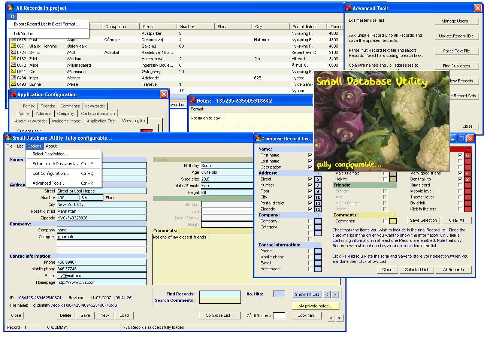

## Small Database Utility

### Description

Since the first time the Small Database Utility code was submitted to PlanetSource a large number of modifications, corrections and additions to the code has been carried out in response to input from a number of users. Some of the improvements are listed here:

1. a small, separate utility performing auto-update of the exe file

2. improved database backup and disaster recovery facilities

3. options for maintaining the database (duplicate and incomplete records)

4. stable multi-user database sharing via a website copy of the database

5. templated for creating new databases

6, build-in option for exporting selected database fields to Excel

7. + a large number of small refinements throughout the program

You can download and install the compiled program at:

http://www.swr.dk/software/03_00_database.php

to see the the Small Database Utility in action.

Please note that vlmnuplus.ocx which is used to create the small icons at menu items is not included in the source code, but must be purchased from Viklele associates. It should, however be fairly easy either to remove the menu icons - or to find another method of include menu icons.

I should perhaps close this description with my appologies for the structure/logic of the source code. The program has evolved over several years and has grown much by 'natural' branching like my other projects (see for example: www.seqtools,dk). And I have realised that my ambition to delete the whole code and start all over again with a perfect plan will never be fulfilled.
 
### More Info
 
Default password: sdu

Please note that vlmnuplus.ocx which is used to create the small icons at menu items is not included in the source code, but must be purchased from Viklele associates. It should, however be fairly easy either to remove the menu icons - or to find another method of include menu icons.

             |
---                |---
**Submitted On**   |2011-08-22 13:24:08
**By**             |[S\.W\. Rasmussen](https://github.com/Planet-Source-Code/PSCIndex/blob/master/ByAuthor/s-w-rasmussen.md)
**Level**          |Advanced
**User Rating**    |3.7 (11 globes from 3 users)
**Compatibility**  |VB 6\.0
**Category**       |[Complete Applications](https://github.com/Planet-Source-Code/PSCIndex/blob/master/ByCategory/complete-applications__1-27.md)
**World**          |[Visual Basic](https://github.com/Planet-Source-Code/PSCIndex/blob/master/ByWorld/visual-basic.md)
**Archive File**   |[Small\_Data2209878222011\.zip](https://github.com/Planet-Source-Code/s-w-rasmussen-small-database-utility__1-68933/archive/master.zip)

